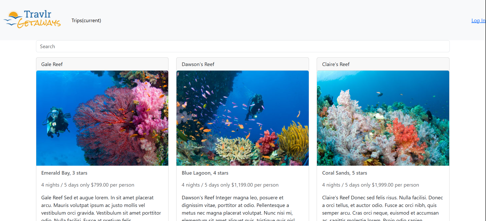

# Data Structures and Algorithms

## Artifact Files
* [Original](original/directory.md)
* [Enhanced](enhanced/directory.md)

For this enhancement, I am using the same Travlr Getaways project as my other enhancements. I have focused on the single page Angular portion of the app, and to showcase my skills in algorithms and data structures I have chosen to implement a search function to be able to search for specific trips out of a list of trip packages for the fictional travel agency. Before this enhancement, users would have been forced to manually scroll through the list of trips to find a specific one, which would be more painful as the data set grows larger. Now with the search function, they can jump straight to any trip in the database. 
The search functionality, contained in the method searchTrips in trip-search.service.ts, uses a hash table containing all of the words in the trips’ titles and descriptions to match words to specific trips. When the user enters text in the search bar, the method will perform one hash table lookup per word in the search text. Since the lookup is O(1), the overall time complexity of the search evaluates to O(n), with n being the number of words in the search text. 
This enhancement fulfills course outcome 3 by using algorithmic principles of computer science to solve a given problem. I had to work through a few design choices when planning this enhancement, such as whether to pull from the database with every search or to cache all the trip data and filter it from there.

