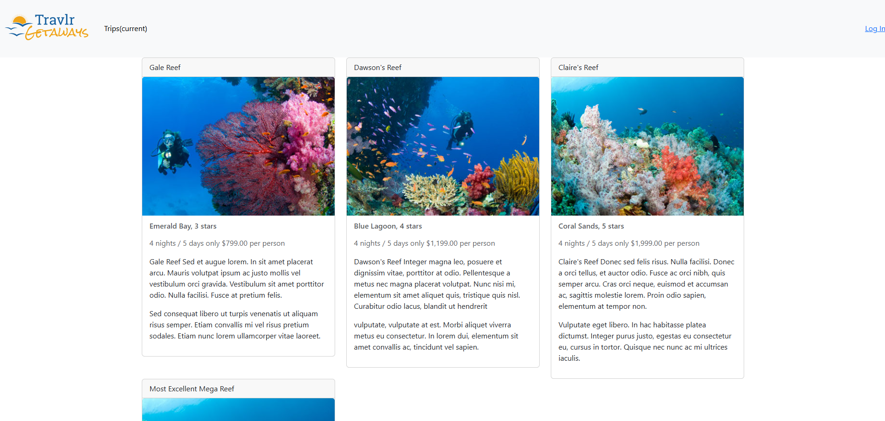
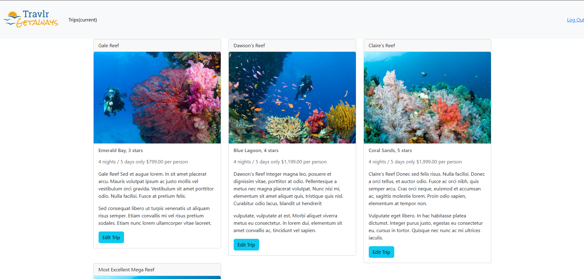
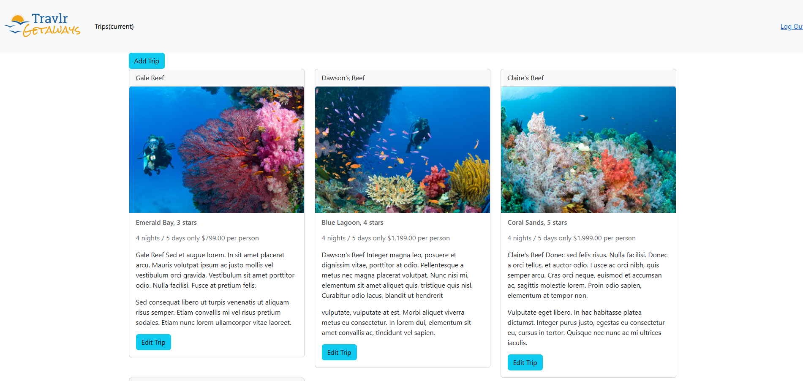

# Software Engineering

## Artifact Files
* [Original](src-software-engineering/original/)
* [Enhanced](src-software-engineering/enhanced/)

This artifact, the Travlr Getaways website, was created during my CS-465 class and is a MEAN stack web application for a fictional travel agency. For the software development enhancement, I chose to implement a role-based-access-control system to ensure that only specific users are allowed to access more advanced functionality. This enhancement focused specifically on the single-page admin application of the app, which presents a list of trips that customers would see from the customer facing site and allows company staff to manage these trips from the admin page. 
RBAC was a much-needed enhancement to this artifact. The original was meant to simply introduce students to full-stack development and didn’t flesh out any of its’ functionality. There was a security framework put in place in the form of user accounts that could remain logged into a session via a json web token, but the application itself didn’t restrict any of its’ functionality based on who was logged in, and would even allow users to perform add and edit actions without being logged in at all. In this enhancement, I have modified the user schema to now include a “role” field, which can be either “admin” or the default of “user”. Now, when the site is first opened and there is no user logged in, none of the buttons to add or edit trips are visible.

 
If a regular user without admin rights logs in, they will see an edit button appear on each trip card, but will still lack the button to add a new trip. 

 
Additionally, if an admin user logs in, they will see an additional button to add a new trip.

 
Aside from the schema modification to add the additional “role” field, I tightened up a few other areas as well. The buttons won’t display if the user isn’t logged in with the appropriate user role, which is achieved by adding a condition to the HTML controls that uses the authenticationService to individually check that the user is logged in and is an admin. But that alone wouldn’t stop a malicious user from trying to navigate to the add/edit trip pages by adding the API endpoints to the URL. To prevent this, I added an Angular guard file that will ensure a user is authorized, denying access and returning the user to the previous route. 
	This enhancement adequately covers course outcome 5 by safeguarding app functionality that can alter the application’s data to ensure that only users who are properly authenticated and authorized can access this functionality. Through this enhancement, I learned about Angular “guards”, which are used to control access to different routes in a web application. I hadn’t used these before, although it was briefly mentioned but never expanded on in my CS-465 class.

